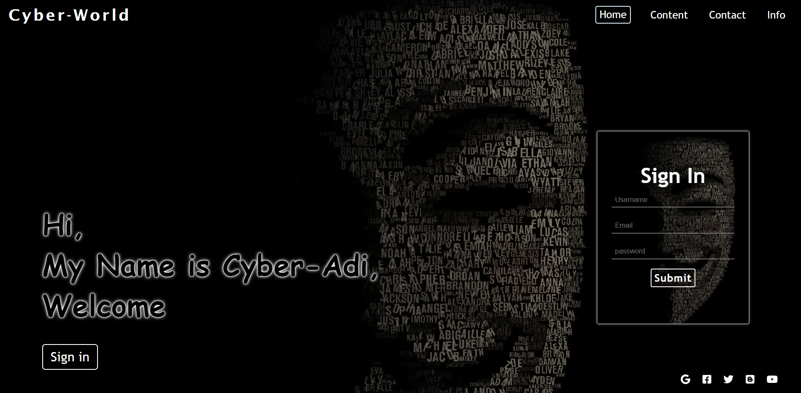

<h1 align="center">Hi 👋, I'm Aditya Pawar</h1>

<h3 align="center">''' Unlock the world of endless possibilities through the language of code '''</h3>
  

  

- 🌱 I’m currently learning about **Backend**

- 👨‍💻 All of my projects are available at [https://github.com/AdityaByte/](https://github.com/AdityaByte/)

- 📫 How to reach me **https://github.com/AdityaByte/**

- ⚡ Fun fact **I think I would learn everything**

<h3 align="left">Connect with me:</h3>

<h3 align="left">Preview my <em>Frontend project</em></h3>

<h4 align="center">And</h4>

  

 

### :hammer_and_wrench: Languages and Tools :

